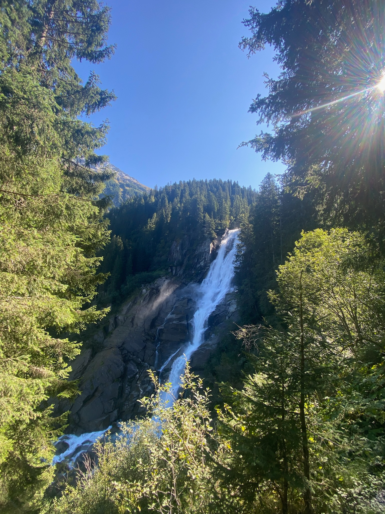

+++
title = "Krimml Waterfalls: How we visited Europe's highest waterfalls for free"
date = 2024-05-21
draft = false
tags = ['Austria','Travel','Budgeting']
image = "emily-krimml.jpg"

+++

Ever picture yourself standing beneath Europe's largest waterfall, surrounded by the beauty of nature, all while being there for free? Well, prepare as we spill the secrets on experiencing the Krimml Waterfalls on a budget!   

Located in the Pinzgau region in Austria, this tiered waterfall plunges down in three stages, with the highest point reaching 1,470 metres above sea level. Being the largest waterfall in Europe and the fifth largest in the world, it's a sight that words can't quite capture, and photos only hint at the sheer size and magnificence.

Join us as we show you how you can make your visit to the Krimml Waterfalls a completely free day out.



Money-saver #1

## Using the free Alter Tauernweg walking trail to access Krimml Waterfalls

You might not be aware that the area around Krimml itself is actually just a public area, and the only paid section is the entrance which guides ticket-holders around a re-constructed path with viewing platforms along the way.

To access the free walking trail, you need to follow the normal route to the waterfalls which you will find just after the Water Worlds ticket building on the main road (just follow the crowd!). Continue on this path until you reach the souvenir shops and ticket gate. Look for a trail to your left with public footpath signs and follow this until you reach a small bridge crossing. After crossing the bridge, continue on the free Alter Tauernweg trail.

‘Alter Tauernweg’ translates to ‘Old Tauern Trail’, it’s an old path that dates all the way back to the 16th century. The Alter Tauernweg walking trail is, although more physically demanding, a much more peaceful way to visit Krimml Waterfalls by avoiding the crowds, especially during peak periods.

Here’s why we think that taking the free walking trail to access Krimml Waterfalls is a great alternative to entering via the ticket gate with everyone else.

- Taking the Alter Tauernweg walking trail to access Krimml Waterfalls is completely free.
- Technically, the Alter Tauernweg walking trail is accessible all year round (at your own risk!), regardless of seasons or weather conditions whereas the ticket gate is only open from mid-April to late October, which restricts out of season visitors.
- You’ll escape the crowds. Taking your time to enjoy the views in a quieter atmosphere makes for a much more peaceful day at Krimml Waterfalls.
- You can still access the best views at the top with everyone else! As you can see below, the Alter Tauernweg walking trail later joins the same trail used by ticket-holders to reach the top of the waterfall. Cool right?!

There are some reasons why we think that taking the free walking trail to access the falls isn’t for everyone, here’s a few reasons why it might not suit you!

- There aren’t any public toilets or restaurants on the free walking trail, so we’d recommend taking the ticketed trail if this is something that matters to you
- A higher fitness level is required. While the ticketed trail is also steep in places, the free trail is a rocky, steep hiking trail. You should be prepared for steeper and uneven terrain in some areas.
- There is no disabled access, unlike the ticketed trail which offers access to the lower sections of the waterfall. Anyone requiring disabled access should opt for the ticketed trail to access the lower sections of the waterfall easily.
- Although there are fenced viewing points throughout the Alter Tauernweg walking trail before it joins onto the ticketed trail, there are no designated viewing platforms which may limit perfect panoramic views.

Money-saver #2

## Parking close to Krimml Waterfalls

When arriving in Krimml it's hard to miss the many ‘waterfall parking’ signs, funnelling tourists to the paid parking spots right next to the entrance simply named P1, P2, P3 and P4. While they might seem appealing at first, it’s worth considering that Krimml is a very small town and there is free parking only a 15 minute walk away. You’ll also get a better picture of the local area arriving this way.

Here is a breakdown of the walking time and costs below: 

- Parkplatz 1 (P1): 14 min walk (€6 a day)
- Parkplatz 2 (P2): 9 min walk (€7 a day)
- Parkplatz 3 (P3): 9 min walk (€7 a day)
- Parkplatz 4 (P4): 8 min walk (€5 for the first 2 hours)
- Parkplatz Gebührenfreier: 15 min walk (Free)

As you can see, the free parking option requires just a slightly longer walk but saves you the expense. The cost is only going to keep increasing year after year.

We found the Gebührenfreier Parkplatz on the Park4Night app, but the location is also available on Google Maps. We recommend using Park4Night as this is a great resource providing details about different types of parking locations, especially if you’re travelling in a motorhome or campervan. Others leave reviews so you know that the area is safe and gives you peace of mind when leaving your vehicle.

There is not a lot of free parking in Krimml, so to secure a space we arrived early as it can fill up quickly, especially in the summer months. An important point to note is you cannot park here between 22:00-05:00, so you probably won’t get away with staying here overnight (sorry campers!), which is often the case with popular areas like Krimml in close proximity to a large attraction. The paid parking areas are not far from here, so make sure you end up in the right place, the Gebührenfreier Parkplatz is right opposite the Intersport shop.

Money-saver #3

## Avoiding the Gerlos Pass toll-road fees 

If you choose to drive to Krimml, one cost you can avoid is the Alpine toll road, known as the Gerlos Pass. This toll charges €12 for cars/motorhomes or €8.50 for motorbikes. If travelling from East to West (from Zell am See), you can bypass the toll road by following directions to Krimml without encountering it. 

If you are travelling from West to East, stick to the 165 road and continue following it to Krimml. When leaving Krimml, heading West, you will need to go back on yourself to reach the 165 road again. A helpful tip is to set your navigation app to avoid tolls to ensure you steer clear of toll roads and navigate in and out of Krimml hassle free. 

By following these tips, you can reach Krimml and enjoy the scenery along the way without the added expense of the alpine toll road.



## How much did we save during our visit to Krimml Waterfalls?

As a couple on a budget, we saved €33 through taking the free Alter Tauernweg trail instead of the ticketed trail, avoiding the Gerlos Pass toll-road fees and parking for free. We feel that attractions bestowed by nature should be accessible to everyone. Savings like this enable us to spend our money on alternatives like going out for lunch, still contributing to the local community. Just imagine the potential savings for a family of five in a similar situation.

- Entrance tickets: Adult €8, Child (6-15yrs) €4
- Gerlos pass alpine toll road:  Car/Motorhome day ticket €12, Motorbike €8.50
- Parking: €5

While the ticketed trail offers the convenience of a reconstructed path with viewing platforms, the free walking trail gives an alternative that's not only budget-friendly but also provides a more adventurous experience. By following the free walking trail you can explore the natural beauty at your own pace, away from the crowds and visit Europe's highest waterfall for free!

## Best time of year to visit Krimml Waterfalls

We visited Krimml waterfalls in September and this was a great time of year to go. The weather was great, it was fairly quiet and being early autumn, the waterfalls are still very fast flowing. The falls generally have the highest amount of flowing water in the summer months of June and July as the higher temperatures melt the glaciers above causing more water to fall. It would still be worthwhile visiting the waterfalls in winter, as parts of the waterfall are frozen which would be incredible to see.

Regardless of the season, consider visiting on weekdays to avoid weekend crowds.

## How to get to Krimml by car

Travelling by car offers flexibility and convenience, allowing you to explore on your own time. We believe this is the easiest option, but there are some points to consider. To drive on the motorways in Austria, you will need to purchase a vignette prior to your journey. The service offers a new 1 day digital vignette which is perfect if you plan to rent a car just for the day.

The cost for an Austrian vignette is as followed: 
Cars/Campervans (up to 3.5t):
- 1 day (digital version only) - €8.60
- 10 days - €11.50
Motorbikes: 
- 1 day (digital version only) - €3.40
- 10 days - €4.60

If time isn’t on your side it might be worth purchasing a vignette for your trip, however, it depends on where you are based. Krimml is located only a couple of hours from two major cities in Austria, Innsbruck and Salzburg.

From Innsbruck Airport to Krimml the fastest route will take 1 hour 38 minutes by car, but a vignette is required as you will be travelling on the motorway. If you have the time, you can consider taking the toll-free route which only adds an extra 33 minutes to your journey time.

From Salzburg Airport to Krimml the fastest route is toll-free and takes 2 hours 6 minutes, crossing through Germany. Don’t worry about any toll road fees in Germany, these only apply to vehicles weighing 7.5t or more.

We drove to Krimml in our campervan and always choose to take the toll-free roads where possible throughout our travels. We’re lucky enough to not have to worry about time, and we prefer to take the scenic route rather than being stuck on the motorway.

Don’t forget, there is a toll-road near Krimml Waterfalls called the Gerlos Pass alpine road, but it’s possible to avoid this. If you missed it, go back to Money-saver #3 above for more information on how you can dodge the Gerlos Pass.

## How to get to Krimml by train or bus 

For budget-conscious travellers, public transport from Salzburg, the nearest major city, is a viable option. Salzburg offers regular train services to Zell am See, starting from €17 and taking on average 1 hour 30 minutes. From here you can catch the bus to Krimml for €12 which will take you a further 1 hour and 30 minutes.

You can catch the train from Zell am See to Krimml, but the train station is a 45 minute walk to the waterfalls. The bus will drop you off directly outside the entrance to the falls which is much more convenient.

## Essential Tips for Krimml Waterfalls via Alter Tauernweg

- Take a picnic with you as there are no restaurants on the free Alter Tauernweg trail but there are benches for pit stops
- Make sure you take plenty of water, especially if it’s a hot day. The trail is tough and a medium level of fitness is recommended
- Remember! There aren’t any public toilets on the free Alter Tauernweg trail.
- The trail is a 10.72km round trip, so we’d recommend allowing at least 3 hours to complete the hike. It took us 2 hours 42 minutes, gaining 697m (2286ft), which includes stopping to see the waterfall and a few breaks throughout.

